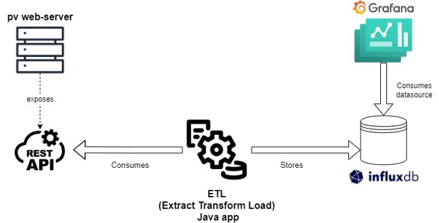

# PortfolioScan

## Overview
PortfolioScan is a Java-based project that utilizes Maven for dependency management and build automation.
The primary goal of this project is to provide tools and functionalities related to mining and analyzing
temporal product line engineering data. This includes the following:
- Mining the history of product line models from a data source of your choice. Originally PortfolioScan was 
  implemented for pure::variants, but we have made it open source, so you can implement support for any other 
  portfolio managament platform like Git or FeatureIDE.
- Transforming the mined models into a format that can be stored in an InfluxDB database.
- Storing the transformed models in an InfluxDB database.
- Grafana Dashboards available at folder `GrafanaDashboards` serve as examples to build Grafana graphs on top of an InfluxDB database.

The following image depicts the overview of portfolioscan's architecture:


## Getting Started


### Prerequisites
- Java JDK 8 or higher
- Maven 3.0 or higher

### Setting-up the Project
1. Clone the repository to your local machine.
2. Navigate to gen folder and run `mvn clean install` to build both api and services projects and install the necessary dependencies.
2. Navigate to the root directory of the project.
3. Run `mvn clean install` to build the project and install the necessary dependencies.

### Implementing your extractor
PortfolioScan follows an Event-Driven-Architecture. If you want to extend it with your own extractor, 

### Configuration
#### Configuring PortfolioScan
Before running the application, it's crucial to configure the `application.properties` file to suit your specific environment. This file contains essential settings, such as database connections, API keys, and other environment-specific parameters. Follow these steps:

1. Locate the `application.properties` file within the `src/main/resources` directory.
2. Edit the file to reflect your environment's settings. This includes the following:
    - InfluxDB's connection settings: API key, organization, bucket, and URL
3. Save the changes before running the application.

Ensuring that the `application.properties` file is correctly configured is vital for the successful operation of the application in your specific environment.

#### Configuring InfluxDB Instance
The easiest way to set up an InfluxDB instance is to use Docker. Follow these steps:
1. Install Docker on your machine.
2. Run the following command to start an InfluxDB instance:
    ```
    docker run --name influxdb -p 8086:8086 -v influxdb:/var/lib/influxdb influxdb
    ```
3. Open a browser and navigate to `http://localhost:8086`. This will open the InfluxDB's web interface.
4. Configure the InfluxDB instance by following the instructions in the [InfluxDB documentation](https://docs.influxdata.com/influxdb/v2.0/get-started/).
5. Check [Manage API Tokens](https://docs.influxdata.com/influxdb/v2/admin/tokens/) to create a token for the InfluxDB 
   instance. This token will be used in the `application.properties` file to connect to the InfluxDB instance.
6. Once the InfluxDB instance is configured, you can use the `application.properties` file to configure the 
   application to connect to the InfluxDB instance.


### Running the Application
- Execute `mvn exec:java` from the root directory to run the main application. Ensure that the `pom.xml` file is configured with the correct main class.
- You can also package the application into a JAR file by running `mvn package`. This will create a JAR file in the 
  `target` directory. You can then run the application by executing `java -jar target/portfolioscan-{version}.jar`.
- Alternatively, you can run the application from your IDE by running the main class `src/main/java/com/portfolioscan/Main.java`.

### Setting-up Grafana Dashboards
The `GrafanaDashboards` folder contains a set of Grafana dashboards that can be used to visualize the data stored in the InfluxDB database. Follow these steps to set-up the dashboards:
1. Install Grafana on your machine. The easiest way to do this is to use Docker. Run the following command to start a Grafana instance:
    ```
    docker run -d --name=grafana -p 3000:3000 grafana/grafana
    ```
2. Open a browser and navigate to `http://localhost:3000`. This will open the Grafana's web interface.
3. Log in to Grafana using the default credentials: `admin` for both username and password.
4. Configure the Grafana instance by following the instructions in the [Grafana documentation](https://grafana.com/docs/grafana/latest/installation/).
5. Once the Grafana instance is configured, you can import the dashboards from the `GrafanaDashboards` folder. To do this, follow these steps:
    1. Click on the `+` icon on the left side of the screen.
    2. Select `Import` from the menu.
    3. Click on `Upload JSON File` and select the JSON file of the dashboard you want to import.
    4. Click on `Import` to import the dashboard.

## Built With
- [Maven](https://maven.apache.org/) - Dependency Management
- [InfluxDB](https://www.influxdata.com/) - Time Series Database
- [Grafana](https://grafana.com/) - Visualization Tool

## Contributors
- [Raul Medeiros](https://github.com/rmedeiros)

